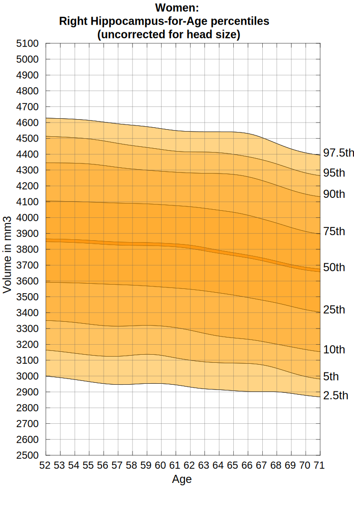

## Quantifying Alzheimer's Disease Progression Through Automated Measurement of Hippocampal Volume

Alzheimer's disease (AD) is a progressive neurodegenerative disorder that results in impaired neuronal (brain cell) function and eventually, cell death. AD is the most common cause of dementia. Clinically, it is characterized by memory loss, inability to learn new material, loss of language function, and other manifestations. 

For patients exhibiting early symptoms, quantifying disease progression over time can help direct therapy and disease management. 

A radiological study via MRI exam is currently one of the most advanced methods to quantify the disease. In particular, the measurement of hippocampal volume has proven useful to diagnose and track progression in several brain disorders, most notably in AD. Studies have shown reduced volume of the hippocampus in patients with AD.

The hippocampus is a critical structure of the human brain (and the brain of other vertebrates) that plays important roles in the consolidation of information from short-term memory to long-term memory. In other words, the hippocampus is thought to be responsible for memory and learning (that's why we are all here, after all!)

Humans have two hippocampi, one in each hemishpere of the brain. They are located in the medial temporal lobe of the brain. Fun fact - the word "hippocampus" is roughly translated from Greek as "horselike" because of the similarity to a seahorse, a peculiarity observed by one of the first anatomists to illustrate the structure.

According to [studies](https://www.sciencedirect.com/science/article/pii/S2213158219302542), the volume of the hippocampus varies in a population, depending on various parameters, within certain boundaries, and it is possible to identify a "normal" range when taking into account age, sex and brain hemisphere. 

There is one problem with measuring the volume of the hippocampus using MRI scans, though - namely, the process tends to be quite tedious since every slice of the 3D volume needs to be analyzed, and the shape of the structure needs to be traced. The fact that the hippocampus has a non-uniform shape only makes it more challenging. Do you think you could spot the hippocampi in this axial slice?

As you might have guessed by now, we are going to build a piece of AI software that could help clinicians perform this task faster and more consistently.

You have seen throughout the course that a large part of AI development effort is taken up by curating the dataset and proving clinical efficacy. In this project, we will focus on the technical aspects of building a segmentation model and integrating it into the clinician's workflow, leaving the dataset curation and model validation questions largely outside the scope of this project.

## Aim

In this project, we built an end-to-end AI system which features a deep learning algorithm that integrates into a clinical-grade viewer and automatically measures hippocampal volumes of new patients, as their studies are committed to the clinical imaging archive.

We used the dataset that contains the segmentations of the right hippocampus and will apply the U-Net architecture to build the segmentation model.

After that, we proceed to integrate the model into a working clinical PACS such that it runs on every incoming study and produces a report with volume measurements.

## The Dataset

We are using the "Hippocampus" dataset from the [Medical Decathlon competition](http://medicaldecathlon.com/). 
This dataset is stored as a collection of NIFTI files, with one file per volume, and one file per corresponding segmentation mask. 
The original images here are T2 MRI scans of the full brain. 
As noted, in this dataset we are using cropped volumes where only the region around the hippocampus has been cut out.
This makes the size of our dataset quite a bit smaller, and allows us to have reasonable training times. 
Algorithms that crop rectangular regions of interest are quite common in medical imaging.

## The Programming Environment
### Local Environment

If you would like to run the project locally, you would need a Python 3.7+ environment with the following libraries for the first two sections of the project:

* nibabel
* matplotlib
* numpy
* pydicom
* PIL
* json
* torch (preferably with CUDA)
* tensorboard

In the deploy section of the project we will be working with three software products for emulating the clinical network. You would need to install and configure:

* [Orthanc server](https://www.orthanc-server.com/download.php) for PACS emulation
* [OHIF zero-footprint web viewer](https://docs.ohif.org/development/getting-started.html) for viewing images. Note that if you deploy OHIF from its github repository, at the moment of writing the repo includes a yarn script (`orthanc:up`) where it downloads and runs the Orthanc server from a Docker container. If that works for you, you won't need to install Orthanc separately.
* If you are using Orthanc (or other DICOMWeb server), you will need to configure OHIF to read data from your server. OHIF has instructions for this: https://docs.ohif.org/configuring/data-source.html
* In order to fully emulate, you will also need to configure Orthanc for auto-routing of studies to automatically direct them to your AI algorithm. For this you will need to take the script that you can find at `Deploy/src/deploy_scripts/route_dicoms.lua` and install it to Orthanc as explained on this page: https://book.orthanc-server.com/users/lua.html
* [DCMTK tools](https://dcmtk.org/) for testing and emulating a modality. Note that if you are running a Linux distribution, you might be able to install dcmtk directly from the package manager (e.g. `apt-get install dcmtk` in Ubuntu)

### Section 1: Curating a dataset of Brain MRIs

3D Slicer visualization of the a hippocampus volume in the training dataset is shown above. The EDA of the dataset is performed in `EDA/Final Project EDA.ipynb`.
Finally, we have 260 training volumes and their corresponding masks.

### Section 2: Training a segmentation CNN

The above pictures show the loss curve of our model on train and validation data, model prediction and model probalility map respectively.

We will be using [PyTorch](https://pytorch.org/) to train the model and [Tensorboard](https://www.tensorflow.org/tensorboard/) to visualize the results.

The script `./train model/src/run_ml_pipeline.py` is written to kick off the training pipeline.

The code has hooks to log progress to Tensorboard. In order to see the Tensorboard output you need to launch Tensorboard executable from the same directory where `./train model/src/run_ml_pipeline.py` is located using the following command:

> `tensorboard --logdir runs --bind_all`

After that, Tensorboard will write logs into directory called `runs` and we will be able to view progress by opening the browser and navigating to default port 6006 of the machine where we are running it.

### Section 3: Integrating into a clinical network

The above figures show the region of hippocampus as predicted by our model (ie. in red color) on the OHIF image-viewer using different layouts.

Ultimately, we create an AI product that can be integrated into a clinical network and provide the auto-computed information on the hippocampal volume to the clinicians. While hospital integrations are typically handled by hospital IT staff, it will help tremendously if we can talk the same language with the people who will operate your model, and will have a feel for how clinical radiological software works. 

Specifically, we have the following software in this setup:

* MRI scanner is represented by a script `Deploy/src/deploy_scripts/send_volume.sh`. When you run this script it will simulate what happens after a radiological exam is complete, and send a volume to the clinical PACS. Note that scanners typically send entire studies to archives.
* PACS server is represented by [Orthanc](http://orthanc-server.com/) deployment that is listening to DICOM DIMSE requests on port 4242. Orthanc also has a DicomWeb interface that is exposed at port 8042, prefix /dicom-web. There is no authentication and you are welcome to explore either one of the mechanisms of access using a tool like curl or Postman. Our PACS server is also running an auto-routing module that sends a copy of everything it receives to an AI server.   
* Viewer system is represented by [OHIF](http://ohif.org/). It is connecting to the Orthanc server using DicomWeb and is serving a web application on port 3005. 
* AI server is represented by a couple of scripts. `Deploy/src/deploy_scripts/start_listener.sh` brings up a DCMTK's `storescp` and configures it to just copy everything it receives into a directory that you will need to specify by editing this script, organizing studies as one folder per study. HippoVolume.AI is the AI module that you will create in this section.

In the directory called `Deploy/src` you will find the source code that forms the skeleton of the HippoVolume.AI module.

`inference_dcm.py` is the file containing the code that will analyze the directory of the AI server that contains the routed studies, find the right series to run our algorithm on, will generate report, and push it back to our PACS.

Note that in real system we would architect things a bit differently. Probably, AI server would be a separate piece of software that would monitor the output of the listener, and would manage multiple AI modules, deciding which one to run, automatically. In our case, for the sake of simplicity, all code sits in one Python script that we would have to run manually after we simulate an exam via the `send_volume.sh` script - `inference_dcm.py`. It combines the functions of processing of the listener output and executing the model, and it does not do any proper error handling :)

## Access Orthanc and OHIF
Before starting to work on the tasks in this workspace you should launch Orthanc and OHIF and here are the steps:

1. Open a terminal and enter the following:
   `bash launch_orthanc.sh` or `./launch_orthanc.sh`. Don't close this terminal
2. Wait for it to complete, with the last line being something like
   `W0509 05:38:21.152402 main.cpp:719] Orthanc has started` and/or you can verify that Orthanc is working by running `echoscu 127.0.0.1 4242 -v` in a new terminal.
3. Open a new terminal and enter the following
   `bash launch_OHIF.sh` or `./launch_OHIF.sh`. Don't close this terminal
4. Wait for it to complete, with the last line being something like
   `@ohif/viewer: ℹ ｢wdm｣: Compiled with warnings.`
5. You will then want to enter the Desktop with the bottom right hand corner.
   - OHIF should automatically open in a Chromium Web Browser but if not you can paste `localhost:3005` into the address bar of a Chromium Window.
   - Orthanc isn't necessary to open but if you need it you can access it can paste `localhost:8042` into the address bar of a Chromium Window.

We can test the code by running
> `deploy_scripts/send_volume.sh`

which will simulate a completion of MRI study and sending of patient data to our PACS, and then following that by running `inference_dcm.py`

The `send_volume.sh` script needs to be run from directory `Deploy/src` (because it relies on relative paths). An MRI scan will be sent to the PACS and to our module which will compute the volume, prepare the report and push it back to the PACS so that it could be inspected in our clinical viewer.

At this point, go to `locahost:3005` which brings up our OHIF viewer. We will be able to inspect our report in all its glory, in the context of a radiological study presented to a radiologist in a clinical viewer!

The study that `send_result.sh` sends, and a few other sample studies are located in `/data/TestVolumes`. Feel free to modify the script to try out your algorithm with other volumes.

Now that we have built a radiological AI system and given it to clinicians, we can start collecting data on how your model performs in the real world. If you (or the company you work for) intends to commercialize your technology, you will have to clear the regulatory bar. As we have discussed in our final lesson, an important contribution of an AI engineer to this endeavor is helping execute the clinical validation by contributing to a validation plan. Remember - clinical validation is all about proving that your technology performs the way you claim it does. If you are saying that it can measure hippocampal volume, your validation needs prove that it actually does, and establish the extents to which your claim is true. Your validation plan needs to define how you would prove this, and establish these extents.

Validation Plan is shown in `Deploy/validation_plan.md`.

## License

This project is licensed under the terms of MIT License.

## Sources

[1] [www.sciencedirect.com/science/article/pii/S2213158219302542](https://www.sciencedirect.com/science/article/pii/S2213158219302542)  
[2] [en.wikipedia.org/wiki/Hippocampus](https://en.wikipedia.org/wiki/Hippocampus)  
[3] [medicaldecathlon.com/](http://medicaldecathlon.com/)
